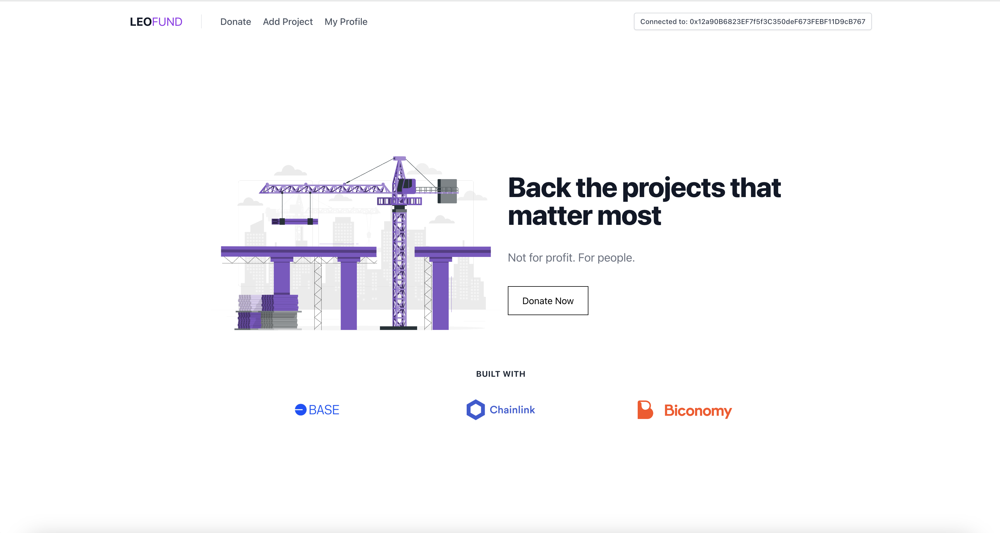

<br>


# LEO FUND

## Description
**Leo Fund** is your gateway to making a difference. Powered by cutting-edge technologies including **Biconomy** for seamless social login, **Chainlink** for reliable data feeds, and built on a secure **Base** chain, Leo Fund empowers you to support a diverse range of projects.

<br>

## Demo

### Home Page



<br>

Github : <a style="margin-bottom: 5px;" href="https://github.com/Novobloc/leo-fund" target="_blank"> Repo Link </a>

Video : <a style="margin-bottom: 5px;" href="put the video like here" target="_blank"> Youtube Link </a>

## Stack We Used

1. Next JS
2. Biconomy
3. Base Sepolia Chain
4. Chainlink


## Steps to Run the Project

1. Clone the repos

```
git clone https://github.com/Novobloc/leo-fund
```

2. Install the dependencies.

```
 yarn
```

3. Start the app using command

```
yarn dev
```

4. Open this link in browser http://localhost:3000

5. Hey, You just ran the code in your system, thats it.

<br>

## Meet Our Team

<div style="display: flex; justify-content: space-between; align-items: center;">
   <p style="flex:1">Shiva Kumar: </p>
   <div style="flex:4; justify-content: space-between;">
      <a href="https://www.linkedin.com/in/shivamangina/" target="_blank">
      
      </a>
      <a href="https://twitter.com/shivakmangina" target="_blank">
      
      </a>
      <a href="https://www.instagram.com/shiva_mangina" target="_blank">
      
      </a>
      <a href="https://github.com/shivamangina" target="_blank">
      
      </a>
   </div>
</div>

<div style="display: flex; justify-content: space-between; align-items: center;">
   <p style="flex:1">Sandeep Kumar: </p>
   <div style="flex:4; justify-content: space-between;">
      <a href="https://www.linkedin.com/in/satyasandeep" target="_blank">
      
      </a>
      <a href="https://twitter.com/satyasandeep76" target="_blank">
      
      </a>
      <a href="https://www.instagram.com/satyasandeep007" target="_blank">
      
      </a>
      <a href="https://github.com/satyasandeep007" target="_blank">
      
      </a>
   </div>
</div>
